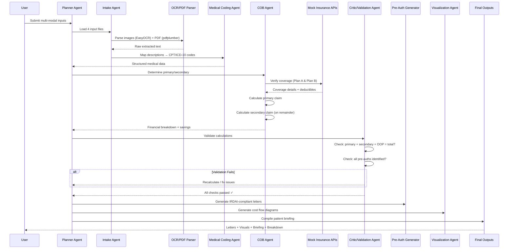

# DuCO-Agent: Agentic Multi-Modal Insurance COB System

> An Agentic, Multi-Modal AI System for Coordination of Benefits (COB) in dual health insurance coverage, built with a Planner-Critic architecture.

---

## Overview

DuCO-Agent automates the complex process of navigating dual health insurance coverage for a married couple (Priya & Aarav Sen). It ingests multi-modal medical documents, coordinates with mock insurance APIs, applies COB rules to optimize out-of-pocket expenses, and generates actionable outputs including pre-authorization letters, financial breakdowns, and visual cost flows.

## Architecture

### Agent Architecture (Planner + Critic Pattern)

```
┌─────────────────────────────────────────────────────────────────┐
│                        PLANNER AGENT                            │
│  Reasons about current state → selects & invokes tools:         │
│                                                                 │
│  ├── parse_image(file)          → EasyOCR text extraction       │
│  ├── parse_pdf(file)            → pdfplumber clinical parsing   │
│  ├── parse_text(file)           → Intent & entity extraction    │
│  ├── lookup_medical_code(desc)  → CPT/ICD-10 mapping           │
│  ├── verify_coverage(plan, cpt) → Mock API coverage check       │
│  ├── check_preauth(plan, proc)  → Pre-auth requirement check    │
│  ├── calculate_claim(plan, amt) → Deductible + coinsurance calc │
│  ├── generate_preauth(claim)    → IRDAI-compliant letter gen    │
│  ├── generate_visual(results)   → Sankey/bar/savings charts     │
│  └── generate_briefing(results) → Patient-friendly summary      │
│                                                                 │
├────────────────────────── ↕ ────────────────────────────────────┤
│                                                                 │
│                        CRITIC AGENT                             │
│  Runs after each major step → loops back to Planner on failure: │
│                                                                 │
│  ├── validate_calculations()    → primary + secondary + OOP     │
│  │                                 == total_charges?            │
│  ├── validate_codes()           → All CPT/ICD-10 in valid set?  │
│  ├── validate_preauth()         → All required pre-auths exist? │
│  └── validate_compliance()      → Non-duplication rule held?    │
│                                    Secondary ≤ what it would    │
│                                    pay as primary?              │
│                                                                 │
│  → Any check fails? → return to Planner with error context      │
└─────────────────────────────────────────────────────────────────┘
```

### State Machine

```
INTAKE → EXTRACTION → COB_REASONING → DOCUMENT_GENERATION → VALIDATION → COMPLETE
                                                                 │
                                                     (if fails) ↓
                                                         loop back to
                                                        relevant state
```

### Sequence Diagram



## Multi-Modal Inputs

| File | Type | Contents |
|------|------|----------|
| `priya_pt_invoice.png` | Image | Scanned PT invoice with handwritten notes, ₹30,000 total |
| `aarav_mri_report.pdf` | PDF | MRI report confirming ACL + meniscus tear |
| `surgeon_estimate.jpg` | Image | Surgeon's billing sheet: CPT 29888 + 29881, ₹4,50,000 |
| `user_query.txt` | Text | Aarav's voice-to-text transcript requesting COB help |

## Assumptions

> **Note**: Actual policy values were not provided in the assessment. The following deductibles, coinsurance percentages, and OOP maximums are mock values used for demonstrating the COB engine. These can be easily reconfigured via `config/insurance_plans.json`.

| Parameter | Plan A (Insurer1) | Plan B (Insurer2) |
|-----------|-------------------|-------------------|
| Primary Holder | Priya | Aarav |
| Annual Deductible | ₹10,000 | ₹15,000 |
| Coinsurance | 80/20 | 70/30 |
| OOP Maximum | ₹1,00,000 | ₹1,50,000 |

## COB Savings Summary

| Claim | Without COB | With COB | **Savings** |
|-------|-------------|----------|-------------|
| Aarav's ACL Surgery (₹4,50,000) | ₹1,45,500 | ₹27,100 | **₹1,18,400** |
| Priya's PT Sessions (₹30,000) | ₹14,000 | ₹14,000 | ₹0 |
| **Family Total** | **₹1,59,500** | **₹41,100** | **₹1,18,400** |

## Project Structure

```
duco-agent-ai-assessment/
├── README.md
├── requirements.txt
├── main.py
├── config/
│   └── insurance_plans.json
├── data/
│   ├── priya_pt_invoice.png
│   ├── aarav_mri_report.pdf
│   ├── surgeon_estimate.jpg
│   └── user_query.txt
├── agents/
│   ├── intake_agent.py
│   ├── cob_agent.py
│   ├── preauth_agent.py
│   └── output_agent.py
├── api/
│   ├── mock_insurance_api.py
│   └── plan_data.py
├── models/
│   ├── claim.py
│   └── policy.py
├── orchestrator/
│   ├── planner.py
│   ├── critic.py
│   ├── state_machine.py
│   └── tools.py
├── parsers/
│   ├── ocr_parser.py
│   ├── pdf_parser.py
│   ├── text_parser.py
│   └── medical_code_mapper.py
├── templates/
│   ├── preauth_letter.j2
│   └── cob_cover_letter.j2
├── outputs/
│   ├── cost_flow_visualizer.py
│   ├── financial_report.py
│   ├── patient_briefing.py
│   └── preauth_pdf.py
├── tests/
│   ├── test_intake_agent.py
│   ├── test_cob_agent.py
│   ├── test_preauth_agent.py
│   ├── test_mock_api.py
│   └── test_calculations.py
├── scripts/
│   └── generate_mock_data.py
└── output/                           # Generated at runtime
```

## Setup & Usage

### Prerequisites
- Python 3.11+
- Tesseract OCR (for pytesseract fallback)

### Installation
```bash
git clone https://github.com/vinayakmish/duco-agent-ai-assessment.git
cd duco-agent-ai-assessment
python -m venv venv
source venv/bin/activate  # On Windows: venv\Scripts\activate
pip install -r requirements.txt
```

### Generate Mock Data
```bash
python scripts/generate_mock_data.py
```

### Run the Agent
```bash
python main.py
```

### Run Tests
```bash
pytest tests/ -v
```

## Outputs Generated
- `output/cost_flow_sankey.png` — Sankey diagram of money flows
- `output/savings_comparison.png` — COB vs. single coverage comparison
- `output/financial_breakdown.md` — Detailed financial report
- `output/preauth_aarav_planB.pdf` — Pre-auth letter (primary)
- `output/preauth_aarav_planA.pdf` — Pre-auth letter (secondary)
- `output/preauth_priya_planA.pdf` — Pre-auth letter (PT)
- `output/patient_briefing.txt` — Plain language patient summary

## License

Private repository — not for redistribution.
